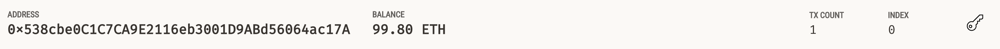
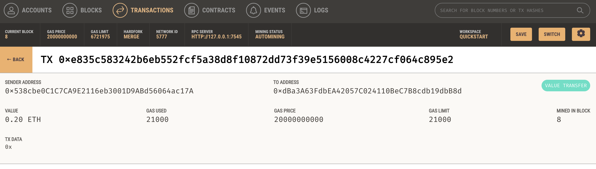

## Fintech Finder Project 

Fintech Finder is an application that its customers can use to find fintech professionals from among a list of candidates, hire them, and pay them. As Fintech Finder’s lead developer, I have been tasked with integrating the Ethereum blockchain network into the application to enable my customers to pay the fintech professionals they hire with cryptocurrency instantly.
In this Project, We will complete the code that enables our customers to send cryptocurrency payments to fintech professionals. To develop and test the code, We will assume the perspective of a Fintech Finder customer using the application to find a fintech professional and pay them for their work.

## Instalation
this chalenge requires the following programs :

- [Visual Studio Code](https://code.visualstudio.com/learn/get-started/basics)
- [python](https://www.python.org/downloads/)
- [streamlit](https://docs.streamlit.io/library/get-started/installation)
- [Ganache](https://trufflesuite.com/ganache/)
- [Web3](https://web3py.readthedocs.io/en/stable/overview.html): A Python library for connecting to and performing operations on Ethereum-based blockchains.
- [ethereum-tester](https://pypi.org/project/ethereum-tester/0.1.0a4/): A Python library that provides access to the tools we’ll use to test Ethereum-based applications.
- [mnemonic](https://pypi.org/project/mnemonic/): A Python implementation for generating a 12- or 24-word mnemonic seed phrase based on the BIP-39 standard.
- [bip44](https://pypi.org/project/bip44/): A Python implementation for deriving hierarchical deterministic wallets from a seed phrase based on the BIP-44 standard.

## Usage 

**steps to run the project

**Step 1** : 

The folowing libraries are required to successfully lunch this project

-Fintech Finder py file :
* import streamlit as st
* from dataclasses import dataclass
* from typing import Any, List
* from web3 import Web3
* w3 = Web3(Web3.HTTPProvider('HTTP://127.0.0.1:7545'))

-Crypto Wallet py file :
* import os
* import requests
* from dotenv import load_dotenv
* load_dotenv()
* from bip44 import Wallet
* from web3 import Account
* from web3 import middleware
* from web3.gas_strategies.time_based import medium_gas_price_strategy

**Step 2** :

In the terminal, navigate to the project folder and run the Streamlit application by using `streamlit run pychain.py`.
Fintech Finder customers will select a fintech professional from the application interface’s drop-down menu, and then input the amount of time for which they’ll hire the worker. (See picture below)

Click the Send Transaction button to sign and send the transaction with your Ethereum account information.

Navigate to the Transactions section of Ganache.

the 99.80 balance confirm that 0.20 Ether was sent (see screenshot below)

## Contributing 

[Karim Bouzina](https://www.linkedin.com/in/karim-bouzina-574348244/)

## License 

UW Fintech 2022 edX Boot Camps LLC

